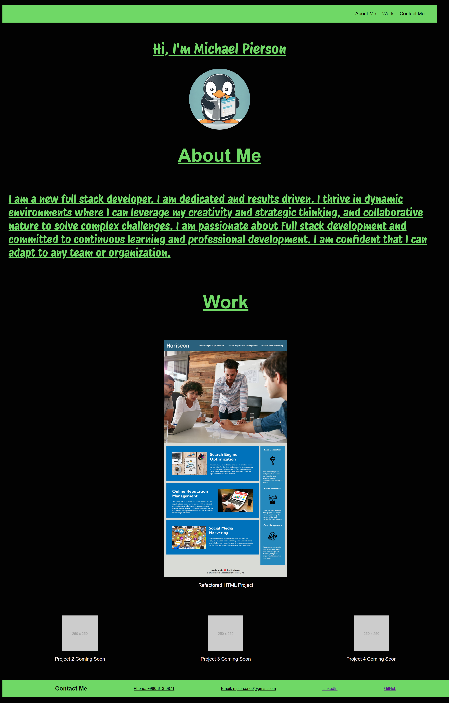

# Michael Pierson's Portfolio

Welcome to the repository for Michael Pierson's Portfolio website. This site showcases my skills, projects, and contact information as a full-stack developer. Built with HTML, CSS, and a touch of JavaScript in the future, it's designed to be responsive and accessible across all devices.

## Features

- **Responsive Design:** The website is fully responsive, designed to look great on devices of all sizes from mobile phones to desktop computers.
- **Portfolio Projects:** Highlights of my most significant projects, with images and links to live demos where applicable.(More to come)
- **Contact Information:** Easy-to-find contact details and links to my professional profiles, including LinkedIn and GitHub.

## Technologies Used

- HTML
- CSS
  - Flexbox for layout
  - Grid for project gallery
- Google Fonts for typography

## Getting Started

To view the project locally, simply clone the repository to your local machine and open `index.html` in your web browser.

Contributing
I am always looking to improve my portfolio and welcome contributions and suggestions. Feel free to fork the repository, make changes, and submit a pull request. If you have any questions or suggestions, please don't hesitate to contact me.

Acknowledgments
Images used in the projects section are placeholders and will be updated as projects are completed.
This portfolio is a work in progress, and I plan to add more features and projects over time.

Thank you for visiting my portfolio repository. I hope you find the projects interesting and informative.

